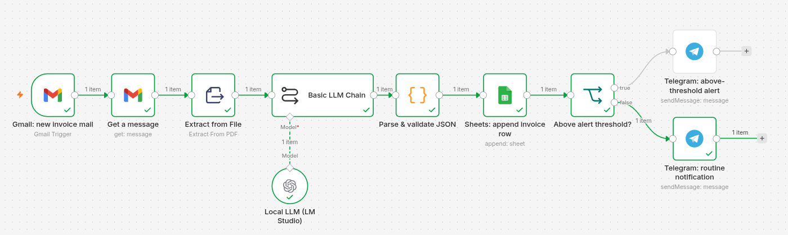
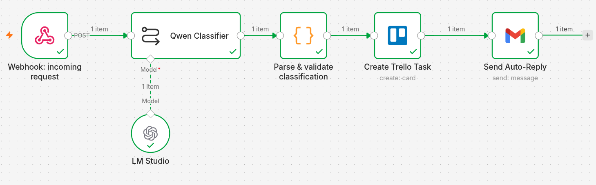

# n8n Automation Workflows

Automation scenarios built in self-hosted n8n, each wrapping an LLM step around a process
that normally eats hours of manual work. Workflows are exported as JSON and import directly.

**What makes these different from most n8n demos: the language model runs locally.** No
invoice, no customer message and no internal document leaves the network. Every scenario here
points at an OpenAI-compatible endpoint served by [LM Studio](https://lmstudio.ai/) on my own
hardware — which is the only version of this that a finance or HR department can actually
approve.

Built by [Roman Zalevsky](https://linkedin.com/in/roman-zalevsky) — fifteen years of ERP
process automation, now applied with low-code tooling and language models.

| # | Scenario | Status |
|---|---|---|
| 1 | [Invoice intake — mailbox to structured data](#1-invoice-intake--from-mailbox-to-structured-data) | ✅ Working |
| 2 | [Request routing — classify, route, answer](#2-request-routing--classify-route-answer) | ✅ Working |
| 3 | Source monitoring — digest instead of feed | 🚧 In progress |

---

## Quick start

```bash
git clone https://github.com/rzalevsky/n8n-automation-workflows
cd n8n-automation-workflows
cp .env.example .env        # fill in your values
docker compose up -d
```

Then open http://localhost:5678, import a workflow, and connect its credentials.
Full walkthrough below.

---

## 1. Invoice intake — from mailbox to structured data

**Problem.** Supplier invoices arrive as PDF attachments. Someone opens each one, reads off
the counterparty, amount, currency, due date and invoice number, and re-types them into a
spreadsheet. It is slow, it is boring, and typos propagate straight into reporting — where
they are expensive to find and awkward to explain.

**Solution.** A Gmail trigger picks up mail matching an invoice filter. The PDF attachment is
extracted to text and passed to a local LLM, which is constrained to return a fixed JSON
schema. A code node validates that result, the row is appended to Google Sheets, and a
threshold check decides whether the notification is routine or needs a human to look at it
before payment.

```
Gmail trigger → fetch message + attachment → PDF to text
      → local LLM (LM Studio) extracts fields as JSON
      → parse & validate  → Google Sheets row
      → amount > threshold ?  → Telegram alert
                              → Telegram routine notification
```

**Result.** Manual re-typing is out of the loop. Invoice data lands structured and queryable
the moment the mail arrives, and anything above the threshold is surfaced immediately rather
than discovered at month-end.

### Design decisions worth explaining

**The model runs locally.** `qwen2.5-7b-instruct-1m` on LM Studio, reached over an
OpenAI-compatible API. A 7B model is more than enough for structured extraction from a
document whose layout barely changes, and running it locally means invoice data — counterparty
names, amounts, payment terms — never reaches a third party. Swapping in a hosted model is a
one-line change if you want it; the point is that you do not have to.

**The parse step fails loudly instead of guessing.** The model is instructed to return raw
JSON, but models occasionally wrap output in a markdown fence or add a sentence of commentary.
The code node strips the fence, then checks that every required field is present and that the
amount is numeric — including the case where a Polish-trained model returns `123,45` instead
of `123.45`. If any check fails it throws with the raw model output attached.

That is deliberate. A failed execution gets noticed; a silently wrong amount in an accounting
sheet does not. In this domain a visible failure is the cheaper outcome, and the error message
carries what you need to diagnose it.

**The threshold check reads from the parsed data, not from the Sheets response.** Google Sheets
returns column values as strings, so comparing them numerically is fragile. The condition
references the validated output of the parse node, where `amount` is guaranteed to be a number.

**Nothing environment-specific is committed.** Sheet ID, Telegram chat ID, alert threshold and
the LLM endpoint are all read as `{{ $env.NAME }}`, supplied by Docker Compose from a
git-ignored `.env`. The mail filter in the exported JSON is a generic placeholder — my own runs
against a specific sender, but that belongs in my instance, not in a public repository.

### What it looks like



*The full graph after a successful run — item counts on the connections show the invoice
travelling from the mailbox through extraction and validation into the sheet, then down the
routine branch because the amount was below the alert threshold.*

### Known limitations

- `Extract from File` reads the first attachment (`attachment_0`). Mail carrying several
  attachments, or the PDF in second position, needs a loop or a filter node ahead of it.
- Password-protected PDFs — common with some providers' e-invoices — are not handled.
- Text-layer PDFs only. A scanned invoice needs an OCR step before extraction.
- Polling runs hourly. For higher volume, a push-based trigger beats polling on both latency
  and API quota.

### Files

- [`01-invoice-intake/workflow.json`](01-invoice-intake/workflow.json) — importable workflow
- [`01-invoice-intake/screenshot.png`](01-invoice-intake/screenshot.png) — the canvas after a run

---

## 2. Request routing — classify, route, answer

**Problem.** Inbound requests land in one shared inbox or contact form: complaints, product
questions and sales enquiries mixed together, in whatever language the sender happens to write.
Triage is manual, so urgent items sit behind trivial ones, and the reply the customer gets
depends on who happened to look and when.

**Solution.** A public webhook accepts the request. A local LLM classifies it — category,
sentiment, priority and language — and drafts an acknowledgement in the sender's own language.
A code node validates that classification against a closed set of labels, a Trello card is
created with the priority in its title, and the acknowledgement goes out by email.

```
POST /webhook/customer-inquiry  (header auth)
      → local LLM (LM Studio) classifies + drafts reply
      → parse & validate classification
      → Trello card (priority · category · sender)
      → auto-reply email in the sender's language
```

**Result.** Triage happens on arrival rather than when someone opens the inbox. An angry
complaint is labelled High and lands on the board within seconds, and the sender gets a reply
in their own language instead of a template in the company's.

### Design decisions worth explaining

**One model call does four jobs.** Category, sentiment, priority, language detection and the
drafted reply all come back in a single structured response. Chaining five separate calls
would be easier to draw and slower, costlier and more failure-prone to run.

**Validation is stricter here than in scenario 1, because the output is public.** An invoice
row with a wrong value is an internal problem discovered at month-end. A malformed auto-reply
is sent to a customer and cannot be recalled. So the parse node checks three things before
anything leaves the building: that the response is valid JSON, that every required field is
present, and that `category`, `sentiment` and `priority` each hold one of their permitted
values. A hallucinated label like `urgent` instead of `High` stops the run rather than
producing a mis-routed ticket.

It also treats the webhook payload as untrusted input and verifies `name`, `email` and
`message` are present — a public endpoint receives whatever the internet sends it.

**The webhook requires authentication.** Header auth on the endpoint. An open URL that sends
email from a company mailbox and writes to its task board is not a demo, it is an incident
waiting to be discovered by someone else.

The secret itself is not stored in the credential — the credential resolves it from the
environment with `{{ $env.WEBHOOK_SECRET }}`, the same pattern the Trello key uses. One place to
rotate it, and nothing sensitive in either the workflow JSON or n8n's database.

Worth recording, because getting there cost an hour of confusion: both failure modes look
almost identical from the outside, and neither means what it appears to mean. A uniform `404`
on every call is not a routing mistake — it is an unpublished workflow, so the route was never
registered. A uniform `403`, including with the correct secret, is not a wrong secret — it is
the environment variable not having reached the running container, or a credential change that
was never republished. Compose only substitutes variables at start-up, so `docker compose
restart` will not pick up an edited `.env`; it takes `docker compose up -d` to recreate the
container. Testing all three cases — no header, wrong secret, correct secret — is what makes
the difference visible, because a broken setup answers `403` to all three while a working one
answers `403`, `403`, `200`.

**It answers immediately and works afterwards.** `responseMode: onReceived` returns the
acknowledgement as soon as the request is accepted, instead of making the caller wait through
model inference, a Trello write and an SMTP round trip. A contact form that hangs for ten
seconds gets submitted twice.

**Multilingual by design, not by translation.** The model detects the language and writes the
reply in it. Polish, English and Russian were tested — which is the actual language mix in this
market, and the reason I built it this way rather than replying in one fixed language.

### What it looks like



*The graph after a successful run — a request entering through the authenticated webhook,
classified by the local model, validated, turned into a Trello card and acknowledged by email.*

### Known limitations

- The payload schema is checked after the model call, not before. Validating first would save
  an inference on malformed input — negligible with a local model, worth changing against a
  paid API.
- No rate limiting. Header auth stops casual abuse; a shared secret that leaks does not stop
  volume.
- No deduplication. A form submitted twice creates two cards.
- Trello list is fixed. Routing complaints and sales enquiries to different lists would be a
  switch node ahead of the card creation.

### Files

- [`02-request-routing/workflow.json`](02-request-routing/workflow.json) — importable workflow
- [`02-request-routing/screenshot.png`](02-request-routing/screenshot.png) — the canvas after a run

---

## Running the stack

### 1. Configure

```bash
cp .env.example .env
```

Fill in `.env`:

| Variable | What it is |
|---|---|
| `GOOGLE_SHEET_ID` | The part of your sheet's URL between `/d/` and `/edit` |
| `TELEGRAM_CHAT_ID` | Message your bot, then read it from `https://api.telegram.org/bot<TOKEN>/getUpdates` |
| `INVOICE_ALERT_THRESHOLD` | Amount above which the alert branch fires. Defaults to `500` |
| `LLM_BASE_URL` | Your OpenAI-compatible endpoint — see the networking note below |
| `TRELLO_LIST_ID` | Trello list that receives routed request cards (scenario 2) |
| `GENERIC_TIMEZONE` | Defaults to `Europe/Warsaw` |

`.env` is listed in `.gitignore`. Nothing you put there reaches the repository.

### 2. Start n8n

```bash
docker compose up -d
docker compose logs -f n8n     # follow start-up
```

n8n comes up on http://localhost:5678.

The compose file uses `network_mode: host`, which keeps the container on the host's network
stack. That matters for reaching a local model:

| Setup | `LLM_BASE_URL` |
|---|---|
| `network_mode: host`, model on this machine | `http://localhost:1234/v1` |
| `network_mode: host`, model on another machine | `http://<lan-ip>:1234/v1` |
| Bridge networking (`ports: ["5678:5678"]`), model on the host | `http://host.docker.internal:1234/v1` |

`host.docker.internal` does **not** resolve under host networking — it is a bridge-mode
facility. Getting this wrong is the most common reason the LLM node times out.

Compose substitutes `${VAR}` from `.env` at start-up, and those values become environment
variables inside the container, where the workflow reads them as `{{ $env.VAR }}`. That chain
is why no sheet ID, chat ID or endpoint appears in the workflow JSON.

For expressions to see them, n8n needs `N8N_BLOCK_ENV_ACCESS_IN_NODE=false`. That is already
n8n's default; the compose file sets it explicitly so the dependency is visible rather than
implied.

### 3. Serve a local model

[LM Studio](https://lmstudio.ai/) or [Ollama](https://ollama.com/), with the OpenAI-compatible
server enabled. Any instruction-tuned 7B model handles structured extraction; this one uses
`qwen2.5-7b-instruct-1m`.

Check it is reachable from the container:

```bash
docker compose exec n8n sh -c 'wget -qO- $LLM_BASE_URL/models'
```

The quoting matters: it defers expansion to the container's shell, where `LLM_BASE_URL`
actually exists. A list of models means the endpoint is reachable; a hang or a connection
refusal means the address is wrong for your networking mode.

### 4. Import the workflow

In n8n: **Workflows → Import from File** → pick `01-invoice-intake/workflow.json`.

### 5. Connect credentials

Gmail OAuth2, Google Sheets OAuth2, a Telegram bot token, a Trello API key and the webhook's
header-auth secret are all configured in n8n's own credential store, not in this repository. n8n encrypts them at rest and never writes them into
an exported workflow — which is why the JSON here carries credential *names* but no secrets.

Adjust the Gmail trigger filter to match your own invoices. The committed value
(`invoices@example.com`, `has:attachment filename:pdf`) is a placeholder.

Scenario 2 additionally needs a **Header Auth** credential on its webhook node. Create it under
**Credentials → Header Auth**, set *Name* to the header (`X-Api-Key` below) and *Value* to a
secret of your own — `openssl rand -hex 32` produces a good one — as `{{ $env.WEBHOOK_SECRET }}`,
matching the value in `.env`. Then select the credential on the webhook node, save, and publish
the workflow. An unpublished workflow answers 404 rather than 403, which is the first thing to
check when testing.

Send the same header pair from whatever posts to the endpoint:

```bash
curl -X POST http://localhost:5678/webhook/customer-inquiry \
  -H 'Content-Type: application/json' \
  -H 'X-Api-Key: <your-secret>' \
  -d '{"name":"Jan Kowalski","email":"jan@example.com","message":"Zamówienie nie dotarło."}'
```

To confirm the guard actually guards, run the same call three ways — no header, a wrong secret,
the real one. The expected answer is `403`, `403`, `200`:

```bash
for h in "" "X-Api-Key: nonsense" "X-Api-Key: $(grep '^WEBHOOK_SECRET=' .env | cut -d= -f2)"; do
  curl -s -o /dev/null -w "%{http_code}\n" -X POST http://localhost:5678/webhook/customer-inquiry \
    -H 'Content-Type: application/json' ${h:+-H "$h"} \
    -d '{"name":"Jan","email":"jan@example.com","message":"test"}'
done
```

## Stack

n8n (self-hosted, Docker Compose) · LM Studio — local OpenAI-compatible LLM · Gmail API ·
Google Sheets API · Telegram Bot API · Trello API

## Licence

MIT — see [LICENSE](LICENSE).
